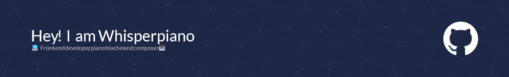

<link rel="stylesheet" href="user.css">

   

Hola from the land of fjords! I'm Jesús, tickling ivories by day and coding pixels by night. From the warmth of Spain to the cool vibes of Norway, I'm on a mission to make music and tech collide in the most harmonious way possible! Let's compose some digital symphonies together! 🎹

### Latest works

<section>

</section>

### 💻 Skills 

<!--
**Whisperpiano/Whisperpiano** is a ✨ _special_ ✨ repository because its `README.md` (this file) appears on your GitHub profile.

Here are some ideas to get you started:

- 🔭 I’m currently working on ...
- 🌱 I’m currently learning ...
- 👯 I’m looking to collaborate on ...
- 🤔 I’m looking for help with ...
- 💬 Ask me about ...
- 📫 How to reach me: ...
- 😄 Pronouns: ...
- ⚡ Fun fact: ...
-->
